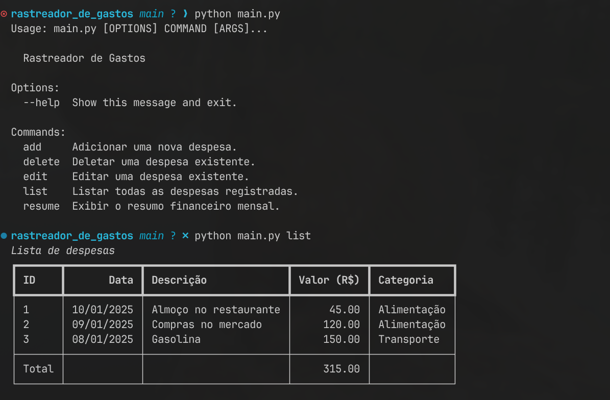

# Rastreador de Gastos


Aplicação em Python para registrar, organizar e consultar os seus gastos de forma simples e prática pelo terminal.  
Os dados são salvos em arquivo CSV.
O projeto foi desenvolvido em Python utilizando as bibliotecas `click` e `rich` para criar uma experiência de terminal mais organizada e interativa.

## Demonstração

Exemplo:



## Funcionalidades

- Registrar novos gastos
- Listar gastos cadastrados
- Salvar informações em arquivo CSV
- Ler os dados salvos anteriormente
- Manter os registros organizados em um arquivo local

## Instalação e Pré-requisitos

### Pré-requisitos
- Python 3.10 ou superior
- Bibliotecas listadas em `requirements.txt`

### Instalação

```bash
git clone <URL_DO_REPOSITORIO>
cd rastreador_de_gastos
python -m venv venv
source venv/bin/activate   # Linux / Mac
venv\Scripts\activate      # Windows
pip install -r requirements.txt
```
## Como usar

Execute o programa com:

```bash
python main.py
```

Se o projeto tiver um menu interativo, siga as instruções exibidas no terminal.

Tu podes usar o seguinte comando para ver as instruções:


```bash
python main.py --help
```

## Estrutura do Projeto

```text
rastreador_de_gastos/
├── main.py
├── expenses.csv
├── requirements.txt
├── LICENSE
├── README.md
└── assets/
    └── demo.png
```

### Sobre os arquivos

- **main.py**: contém a lógica principal do programa.
- **expenses.csv**: armazena os dados dos gastos.
- **requirements.txt**: lista dependências externas.
- **LICENSE**: informa a licença do projeto.
- **assets/**: pasta para imagens e GIFs usados na documentação.

## Exemplo de Uso

1. Execute o programa.
2. Adicione um novo gasto.
3. Consulte os registros salvos.
4. Feche e abra novamente para verificar os dados persistidos no CSV.

## Licença

Este projeto está licenciado sob a **MIT License**.  
Veja o arquivo [LICENSE](LICENSE) para mais detalhes.